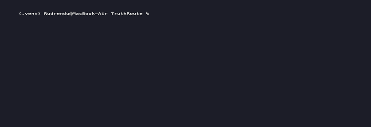
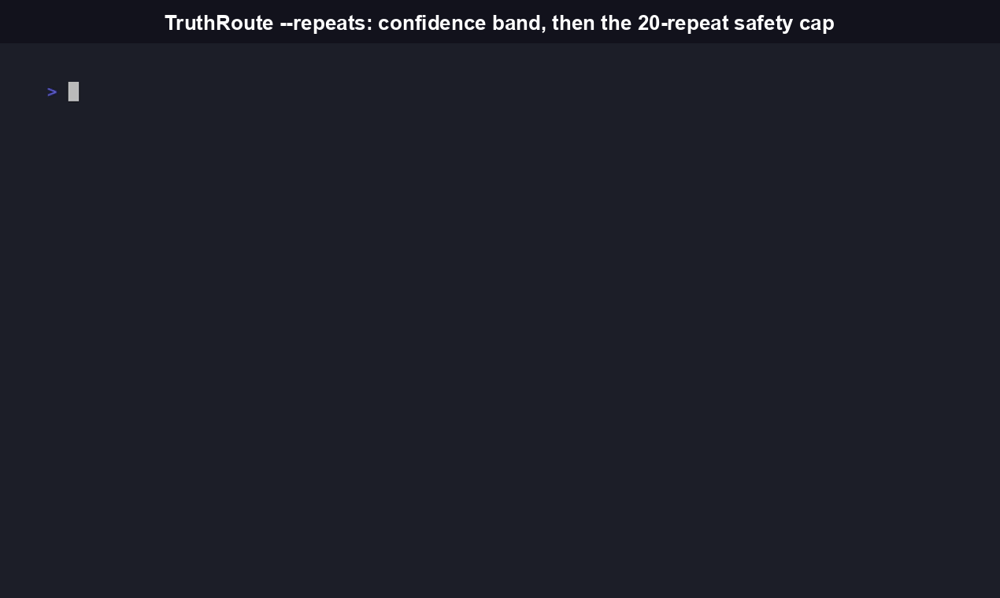

# TruthRoute

[](https://www.npmjs.com/package/truthroute-cli)

Send one prompt to multiple LLMs. Get a real, validated divergence score back. Not a vibe: a number computed from local sentence embeddings, checked against a hand-labeled agree/disagree/negation/paraphrase test set before it shipped.



```bash
npx truthroute-cli compare "is the earth flat?" --models openai,anthropic,gemini
```

## Why this exists

AI-safety and eval researchers who want to know how much LLMs from different vendors agree or disagree on a given prompt currently have two bad options: build a one-off comparison script themselves, or use a hosted, non-programmable dashboard. Neither is embeddable in an eval pipeline, and neither publishes a checked methodology. TruthRoute is a scriptable primitive built for the second use case. Call it from a script, a CI job, or an MCP-capable agent, and get back a number you can actually cite.

## Install

```bash
npm install -g truthroute-cli
```

Or run it without installing:

```bash
npx truthroute-cli compare "<prompt>" --models openai,anthropic,gemini
```

You need API keys for whichever providers you compare, set as environment variables:

```bash
export OPENAI_API_KEY=sk-...
export ANTHROPIC_API_KEY=sk-ant-...
export GEMINI_API_KEY=...
```

Only the providers you actually request need a key set. Every `compare` call makes real, billed calls against the vendor APIs for the providers you request. There is no free tier, because there is no hosted component at all. Use `--dry-run` to see the call count before spending anything.

## Quickstart

```bash
truthroute compare "Was the 2020 US election secure?" --models openai,anthropic,gemini
```

```
--- openai (gpt-5.5) [ok] ---
The 2020 US election faced numerous security reviews...

--- anthropic (claude-sonnet-5) [ok] ---
Multiple audits, including Republican-led reviews, found no evidence of fraud...

--- gemini (gemini-3.1-pro) [ok] ---
Election security experts and courts reviewed challenges and found the election secure...

Divergence score: 0.041 (0 = identical, 1 = maximally divergent)
Status: complete. Computed over all 3 providers.
```

For an agent to consume programmatically:

```bash
truthroute compare "..." --models openai,anthropic --json
```


## CLI reference

```
truthroute compare <prompt> --models <list> [options]

Arguments:
  prompt               the prompt to send to every provider

Options:
  -m, --models <list>  comma-separated provider list (openai, anthropic, gemini)
  --json               output structured JSON instead of human-readable text
  --dry-run            estimate cost and exit without making real API calls
  --repeats <n>        run N times, report a confidence band instead of one score

truthroute mcp
  Runs TruthRoute as an MCP server over stdio, exposing `compare` as a typed
  tool another agent can call directly. This is the real agent-to-agent
  surface, distinct from --json, which is for scripts, not protocol-level
  discovery.
```

## `--json` output shape

```json
{
  "prompt": "...",
  "status": "complete",
  "divergence_score": 0.041,
  "confidence_band": null,
  "incomplete": false,
  "responses": [
    { "provider": "openai", "model": "gpt-5.5", "status": "ok", "text": "...", "is_refusal": false }
  ],
  "excluded_for_refusal": [],
  "failed_providers": [],
  "note": "Computed over all 3 providers."
}
```

`status` is one of `complete` (all providers succeeded), `partial` (at least 2 usable responses, but not all providers succeeded, or one was excluded for refusal), or `failed` (fewer than 2 usable responses, so `divergence_score` is `null`; divergence has no meaning against a single data point).

## Methodology, stated plainly

- **Scoring:** local sentence embeddings (`fastembed`, model `BGESmallENV15`). No paid API for scoring, only the 3 providers being compared. Divergence is `1 - average pairwise cosine similarity` across all response pairs, in `[0.0, 1.0]`.
- **Validated, not assumed.** The model was checked against a hand-labeled test set (`test/fixtures/validation-set.json`) covering agreement, paraphrase, negation, and clear disagreement before shipping. A smaller embedding model (MiniLM-L6) was tried first and rejected during that check: it scored negation pairs as *less* divergent than paraphrases, the opposite of correct. `BGESmallENV15` was chosen because it passes that check.
- **Refusals are excluded from scoring**, not just flagged. A refusal's text distance from a real answer is not factual disagreement, and would otherwise dominate the score.
- **Responses are normalized before scoring** (markdown and formatting stripped) so verbosity differences between providers aren't measured as semantic divergence.
- **Determinism, stated plainly:** all provider calls use `temperature=0`, which reduces but does not eliminate run-to-run variance. Vendor-side inference infrastructure (GPU batching, floating-point non-associativity) can still cause drift independent of anything this tool controls. Use `--repeats N` to get a confidence band instead of trusting a single score as exactly reproducible.


- **A compressed score range is expected, not a bug.** Cosine-similarity scores between two responses to the same topically-related prompt naturally compress into a smaller range than a naive 0-to-1 intuition suggests. The signal that matters is relative ordering (agreement scores lower than disagreement), which is what the validation set actually checks.

## How this compares

[`duh`](https://github.com/msitarzewski/duh) is a full multi-model consensus platform: a propose/challenge/revise/commit debate protocol across 5 providers plus local models, with a web UI, REST API, WebSocket streaming, persistent SQLite/Postgres storage, auth, cost tracking, and PDF export. It is more mature and far more feature-complete than TruthRoute. TruthRoute is not trying to be a smaller version of it. TruthRoute does one narrow thing: score how much N providers' responses to the same prompt diverge, as a stateless CLI/MCP primitive with no server, no database, and no accounts to set up. If you want debate, dissent-tracking, and a full decision-audit platform, use `duh`. If you want a scriptable divergence number to drop into an existing eval pipeline or CI job with nothing to host, that is what TruthRoute is for.

| | TruthRoute | `duh` |
|---|---|---|
| Interface | CLI, MCP server | CLI, REST API, WebSocket, MCP server, web UI |
| Providers | OpenAI, Anthropic, Gemini (3) | Claude, GPT, Gemini, Mistral, Perplexity (5) + local via Ollama/LM Studio |
| Storage | None (stateless) | SQLite or PostgreSQL |
| Setup | `npm install -g truthroute-cli`, API keys as env vars | `uv add duh`, API keys, optional DB/auth setup |
| Core output | A single divergence score (0.0-1.0), validated against a hand-labeled test set | A synthesized decision with confidence score, preserved dissent, and citations |
| Language | TypeScript | Python |
| License | MIT | AGPL-3.0 |

TruthRoute is not an LLM gateway or router (see [LiteLLM](https://github.com/BerriAI/litellm) and [Portkey](https://github.com/Portkey-AI/gateway)). It does no routing, failover, or cost optimization. If you need those, use one of those tools. TruthRoute measures disagreement between providers; it doesn't route between them.

## FAQ

**What does this actually measure?**
How much the substantive content of N LLM responses to the same prompt differs, using local sentence-embedding similarity. It is not a fact-checker. It tells you providers disagree, not which one is right.

**Do I need my own API keys?**
Yes. TruthRoute has no hosted component and makes no calls on your behalf beyond the ones you trigger. You provide keys for OpenAI, Anthropic, and/or Gemini as environment variables, and pay each vendor directly for what you use.

**Is this safe to run against sensitive prompts?**
Any prompt you compare is sent to each vendor's API, the same as if you called them directly. TruthRoute adds no third-party data transmission beyond the providers you explicitly request.

**Can an agent call this directly, not through a human running the CLI?**
Yes. `truthroute mcp` runs an MCP server exposing `compare` as a typed tool over stdio for another agent to call. `--json` output is also available for scripts that shell out to the CLI directly.

**Is this a library or just a CLI?**
Both. It ships as an npm package with a CLI entry point (`truthroute`) and can be run via `npx` with no global install.

**Why is the divergence score so much lower than I expected for two responses I'd say clearly disagree?**
See "A compressed score range is expected" above. This is a known property of cosine-similarity scoring on topically-related text, not a bug. The validated signal is relative ordering, not the absolute number.

## Contributing

Issues and PRs welcome. Run `npm test` before submitting. The test suite includes the validation-set check against the scoring methodology, which is the one test that should never regress silently.

## License

MIT
